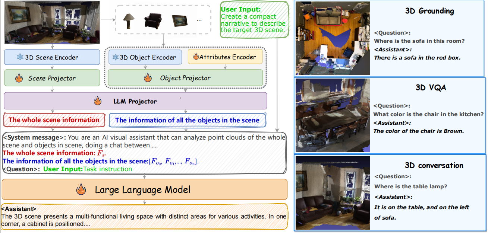

<br />
<p align="center">
  <h1 align="center">3DMIT: 3D Multi-modal Instruction Tuning for Scene Understanding </h1>
  <p align="center">
    <a href="https://staymylove.github.io">Zeju Li</a>, Chao Zhang, Xiaoyan Wang, Ruilong Ren, Yifan Xu, Ruifei Ma, Xiangde Liu
  </p>
  <p align="center">
    <a href='https://arxiv.org/abs/2401.03201'>
      
    </a>
   
  </p>
  <p align="center">
    
  </p>
</p>

# Description

Official implementation of the paper: 3DMIT: 3D Multi-modal Instruction Tuning for Scene Understanding. This paper is accepted by [ICME-3DMM](https://3dmm-icme2024.github.io/).

# Setup

To set up the environment, run the following commands:

```bash
conda create -n 3dmit python==3.10.13
conda activate 3dmit
```

```bash
pip install torch==1.13.1+cu117 torchvision==0.14.1+cu117 -f https://download.pytorch.org/whl/torch_stable.html
pip install -r requirements.txt
```

# Data
Training data

For source 3D scene point clouds,

1) scannet
   
   you can download the processed 3D pcl files by this link:
   ```bash
   https://drive.google.com/file/d/1vTcOFmTK0jvbRpPqggWj2cWx4gA7ulrE/view?usp=sharing
   ```
   
2) 3rscan
   
   you can download the 3D pcl files by its website:
   ```bash
   https://github.com/WaldJohannaU/3RScan
   ```
   
For language instructions, there are tasks including VQA, VG, multi-choice, detection, conversations, etc.

You can download them by this link:

```bash
https://drive.google.com/file/d/1s1ehz8Q6WX9bCghVNtL9sPeulb6886I0/view?usp=sharing
```

put them in this format:

```bash
./datasets/data/3D_Instruct/meta_file
    ├── VQA_all_84w.json  # there are all the data, 840K from 3rscan and scannet
    ├── VQA_all_75w.json  # only from scannet, 740K 3d-text pairs
    ├── VQA_3rscan.json   # 9572 3d-text pairs from 3rscan
```


Eval data

For language instructions, there are 4 eval tasks, you can find them in 

```bash
./datasets/data/3D_Benchmark/meta_file/
    ├── VQA
    ├── multi-choice
    ├── visual grounding
          ├── obj location prediction
          ├── obj index prediction
    ├── detection
```


# 3D features

For scannet: 
```bash
scannet_attributes.json      
scannet_uni3d_feats_1024.pt
scannet_train_attributes.pt  
scannet_uni3d_feats.pt
scannet_ulip2_feats.pt  
```

For 3rscan:
```bash
3rscan_attributes.json     
3rscan_ulip2_feats.pt       
3rscan_uni3d_feats_1024.pt  
 ```
download link: 
```bash
https://drive.google.com/file/d/12kXvxn9iYI20l-5k6MEpyONr1sEGr2o2/view?usp=sharing
 ```

# Model_zoo

```bash
src/
├── model_zoo/
│   ├── epcl_ckpts/
│          ├── epcl_scannet_vit-L-14_256tokens_latest.pth 
│   ├── vicuna-7b-v0
│   ├── vicuna-13b-v0
│   ├── llava1.6-7b
│   └── llava1.6-13b
```

You can download the epcl checkpoint by this link:
```bash
https://drive.google.com/file/d/177yY53BGMELlVFWlmHYArE0HlCFsCntW/view?usp=sharing
 ```

# Ckpt & result

For the result of 3DMIT(Vicuna-7b) with Ulip2 :
```bash
https://drive.google.com/file/d/1Debdd_ZsjiAPhlmrnSgjotPO5XMBcm1T/view?usp=sharing
```

For the result of 3DMIT(Vicuna-7b) with Uni3D :
```bash
https://drive.google.com/file/d/1qTrEtpfG2L-luOcfX7L9JySHOeDjoAtr/view?usp=sharing
 ```


# Model


only using scene info 
```bash
./src/model/3dmit-onlyscene-512.py
```

using scene + objects info
```bash
./src/model/3dmit.py
```
using scene + objects + 2D imgs info
```bash
./src/model/3dmit-scene+obj+img-512.py
```

# Run
Train 3DMIT
```bash
bash ./src/scripts/3DMIT_training.sh
```
Eval 3DMIT
for VQA/description/caption tasks
```bash
bash ./src/scripts/3DMIT_3D_Evaluation_7b.sh
```
for visual grounding task
```bash
python ./src/vg_eval_script.py
```

# Citation

If you find our work useful, please consider citing:
```
@article{li20243dmit,
  title={3DMIT: 3D Multi-modal Instruction Tuning for Scene Understanding},
  author={Li, Zeju and Zhang, Chao and Wang, Xiaoyan and Ren, Ruilong and Xu, Yifan and Ma, Ruifei and Liu, Xiangde},
  journal={arXiv preprint arXiv:2401.03201},
  year={2024}
}
```


# Acknowledge

Our based code: 

https://github.com/OpenGVLab/LAMM

https://github.com/Chat-3D/Chat-3D-v2

https://github.com/Chat-3D/Chat-3D

https://github.com/baaivision/Uni3D
